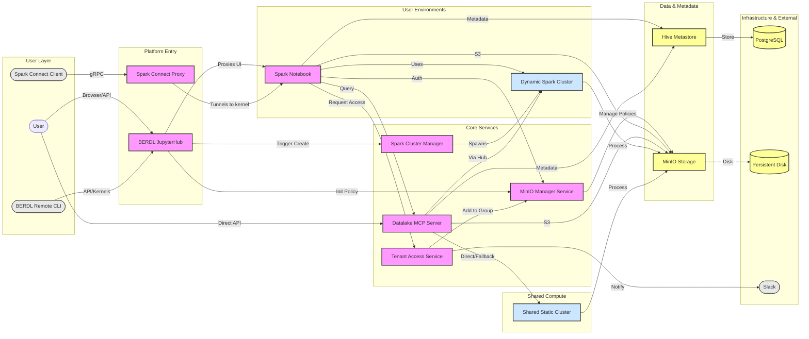
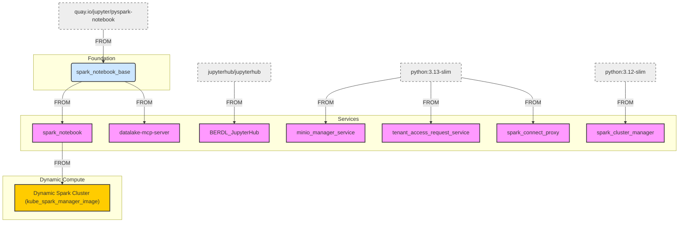
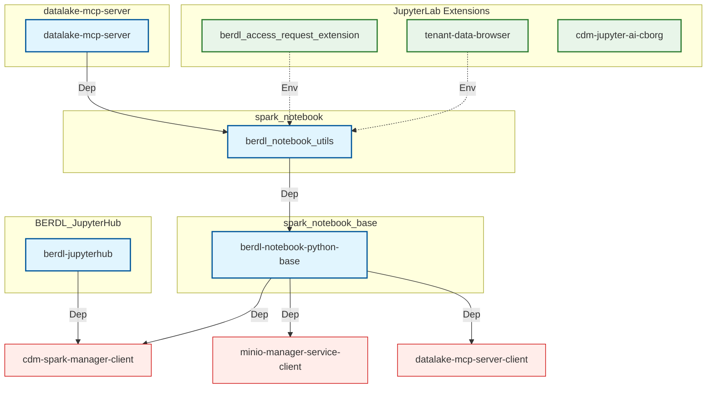

# BERDL System Documentation

This directory contains documentation for the BERDL purpose-built data lakehouse system.

All source code repositories are located in the [KBaseDataLakehouse GitHub Organization](https://github.com/KBaseDataLakehouse).

> **Note**: This documentation provides a brief introduction to each core component of the BERDL system. For detailed development and service information, please refer to each repository's README file.

## Authentication

All BERDL services require **KBase authentication** using a KBase Token. Users must have the **`BERDL_USER`** role assigned to their KBase account to access the platform. Admin operations additionally require the **`CDM_JUPYTERHUB_ADMIN`** role.

## User Guides

Step-by-step guides for working with the BERDL platform. Guides live under [`user_guides/`](./user_guides).

| Guide | Description |
|-------|-------------|
| [Accessing BERDL JupyterHub](./user_guides/user_guide.md) | Getting started: logging in, linking ORCID, roles, and launching a notebook. |
| [KIND*AI](./user_guides/kind_guide.md) | The natural-language front door: AI co-scientist sessions and data portal apps, auto-started for KIND-role holders. |
| [Requesting Tenant Access](./user_guides/requesting-tenant-access.md) | How to request access to tenant groups via the JupyterLab extension. |
| [Tenant SQL Warehouse](./user_guides/tenant_sql_warehouse_guide.md) | Configuring your Spark session to write to a personal or shared tenant SQL warehouse. |
| [Trino SQL Queries](./user_guides/trino_guide.md) | Interactive read-only SQL over your data lake tables with Trino. |
| [Data Sharing](./user_guides/data_sharing_guide.md) | Sharing your datasets with other users and groups. |
| [Object Storage (S3)](./user_guides/s3_guide.md) | Accessing S3 object storage from notebooks with the AWS CLI and `boto3`, and which prefixes hold your files vs. your tables. |
| [MinIO Client & UI](./user_guides/minio_guide.md) | Using the `mc` client and MinIO web UI on environments still running MinIO (staging, production). |
| [Installing Custom Python Packages](./user_guides/custom_packages_guide.md) | Creating a persistent custom virtual environment for extra packages. |
| [Polaris Catalog Migration](./user_guides/iceberg_migration_guide.md) | Migrating from Delta Lake + Hive Metastore to the Polaris (Iceberg) catalog. |
| [Admin: User & Tenant Management](./user_guides/admin_user_management_guide.md) | Administrative operations for managing users, tenants, and access (requires admin role). |

## System Architecture

BERDL utilizes a microservices architecture to provide a secure, scalable, and interactive data analysis environment. The core components include dynamic notebook spawning, secure credential management, and an MCP (Model Context Protocol) server for AI-assisted data operations.

## Container Dependency Architecture

The following diagram illustrates the build hierarchy and base image dependencies for the BERDL services.

## Python Dependency Architecture

The following diagram illustrates the internal Python package dependencies.

## Core Components

| Service | Description | Documentation | Repository |
|---------|-------------|---------------|------------|
| | **Platform Entry & User Environment** | | |
| **JupyterHub** | Manages user sessions and spawns individual notebook servers. | [BERDL JupyterHub](./services/berdl-jupyterhub.md) | [Repo](https://github.com/KBaseDataLakehouse/BERDL_JupyterHub) |
| **Spark Notebook** | User's personal workspace with Spark pre-configured. | [Spark Notebook](./services/spark_notebook.md) | [Repo](https://github.com/KBaseDataLakehouse/spark_notebook) |
| **Spark Notebook Base** | Foundational Docker image with PySpark and common dependencies. | [Spark Notebook Base](./services/spark_notebook_base.md) | [Repo](https://github.com/KBaseDataLakehouse/spark_notebook_base) |
| | **Core Backend Services** | | |
| **MinIO Manager Service** | Central governance authority for credentials, tenants, and IAM policies. | [MinIO Manager Service](./services/minio-manager-service.md) | [Repo](https://github.com/KBaseDataLakehouse/minio_manager_service) |
| **Datalake MCP Server** | FastAPI Data API with MCP layer for AI interactions and direct queries. | [Datalake MCP Service](./services/datalake-mcp-service.md) | [Repo](https://github.com/KBaseDataLakehouse/datalake-mcp-server) |
| **Spark Cluster Manager** | API for managing dynamic, personal Spark clusters on K8s. | [Spark Cluster Manager](./services/spark-cluster-manager.md) | [Repo](https://github.com/KBaseDataLakehouse/spark_cluster_manager) |
| **Tenant Access Request Service** | Slack workflow for users to request access to tenant groups. | [Tenant Access Request Service](./services/tenant-access-request-service.md) | [Repo](https://github.com/KBaseDataLakehouse/tenant_access_request_service) |
| **Hive Metastore** | Central metadata catalog for Delta Lake tables. | [Hive Metastore](./services/hive-metastore.md) | [Repo](https://github.com/KBaseDataLakehouse/hive_metastore) |
| **Spark Cluster** | Spark master/worker image for static and dynamic clusters. | [Spark Cluster](./services/spark-cluster.md) | [Repo](https://github.com/KBaseDataLakehouse/kube_spark_manager_image) |
| | **Data Tools & Frameworks** | | |
| **Data Lakehouse Ingest** | Config-driven PySpark ingestion framework for Bronze→Silver ETL. | [Data Lakehouse Ingest](./services/data-lakehouse-ingest.md) | [Repo](https://github.com/kbase/data-lakehouse-ingest) |
| **Spark Connect Proxy** | Multi-user authenticating layer for Spark Connect requests. | [Spark Connect Proxy](./services/spark_connect_proxy.md) | [Repo](https://github.com/KBaseDataLakehouse/spark_connect_proxy) |
| **Spark Connect Remote Client** | Python library that interfaces with Spark Connect Proxy. | [Spark Connect Remote Client](./services/spark_connect_remote.md) | [Repo](https://github.com/KBaseDataLakehouse/spark_connect_remote) |
| **BERDL Remote CLI** | Local development toolkit for connecting to BERDL securely. | [BERDL Remote CLI](./services/berdl-remote.md) | [Repo](https://github.com/KBaseDataLakehouse/berdl_remote) |
| | **JupyterLab Extensions** | | |
| **BERDL Access Request Extension** | UI for tenant access requests. | [Access Request Extension](./services/berdl-access-request-extension.md) | [Repo](https://github.com/KBaseDataLakehouse/berdl_access_request_extension) |
| **Tenant Data Browser** | Visual navigation of MinIO object storage. | [Tenant Data Browser](./services/tenant-data-browser.md) | [Repo](https://github.com/KBaseDataLakehouse/tenant-data-browser) |
| **CDM Jupyter AI CBorg** | Integration between Jupyter AI and the CBorg LLM provider. | [Jupyter AI CBorg Setup](./services/cdm-jupyter-ai-cborg.md) | [Repo](https://github.com/KBaseDataLakehouse/cdm-jupyter-ai-cborg) |
| | **Generated Client Libraries** | | |
| **MinIO Manager Service Client** | Auto-generated Python client for the MinIO Manager Service. | [MinIO Manager Service Client](./services/minio_manager_service_client.md) | [Repo](https://github.com/KBaseDataLakehouse/minio_manager_service_client) |
| **Datalake MCP Server Client** | Auto-generated Python client for the MCP server. | [Datalake MCP Server Client](./services/datalake-mcp-server-client.md) | [Repo](https://github.com/KBaseDataLakehouse/datalake-mcp-server-client) |
